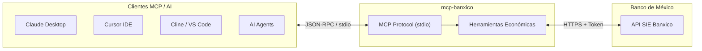

# 🇲🇽 mcp-banxico

[](https://pypi.org/project/mcp-banxico/)
[](https://www.python.org/)
[](https://opensource.org/licenses/MIT)
[](https://modelcontextprotocol.io/)
[]()

Servidor comunitario de **Model Context Protocol (MCP)** para conectar asistentes de Inteligencia Artificial (**Claude Desktop**, **Cursor**, **Cline**, **Gemini CLI**) con el **Sistema de Información Económica (SIE) del Banco de México (Banxico)**.

Permite a tus modelos y agentes de IA consultar en tiempo real el tipo de cambio oficial (USD/MXN), inflación (INPC), valor de las UDIS, tasas de interés interbancarias (TIIE) y cualquier serie económica oficial de México.

> **Proyecto independiente.** No está afiliado ni respaldado por el Banco de México. Consume la API pública del SIE, para la que necesitas tu propio token gratuito.

---

## 🏗️ Arquitectura



---

## ⚡ Instalación y Uso Rápido

No necesitas clonar el repositorio para usarlo. Puedes ejecutarlo directamente con `uvx` o `pip`:

### Opción 1: Con `uvx` (Recomendado para Claude Desktop y Cursor)

```bash
uvx mcp-banxico
```

### Opción 2: Con `pip`

```bash
pip install mcp-banxico
mcp-banxico
```

---

## 🛠️ Configuración en Clientes de IA

### 1. Claude Desktop
Agrega la siguiente configuración a tu archivo `claude_desktop_config.json`:

* **macOS:** `~/Library/Application Support/Claude/claude_desktop_config.json`
* **Windows:** `%APPDATA%\Claude\claude_desktop_config.json`

```json
{
  "mcpServers": {
    "banxico": {
      "command": "uvx",
      "args": ["mcp-banxico"],
      "env": {
        "BANXICO_TOKEN": "TU_TOKEN_DE_BANXICO_AQUI"
      }
    }
  }
}
```

### 2. Cursor IDE
En `Settings` -> `Features` -> `MCP Servers` -> `Add new MCP server`:
* **Name:** `banxico`
* **Type:** `command`
* **Command:** `uvx mcp-banxico`

---

## 📊 Herramientas Disponibles para la IA

| Herramienta | Serie Banxico | Descripción |
| :--- | :--- | :--- |
| `tipo_cambio_usd` | `SF43718` / `SF60653` | Consulta el tipo de cambio oficial peso/dólar (FIX o liquidación), hoy o en un rango de fechas. |
| `inflacion_mexico` | `SP74625` / `SP68257` | Consulta la inflación general anual o mensual de México basada en el INPC. |
| `valor_udis` | `SP68254` | Consulta el valor oficial de las Unidades de Inversión (UDIS) en pesos mexicanos. |
| `tasa_interes_banxico` | `SF61745` / `SF43783` | Consulta la TIIE a 28 días o la Tasa Objetivo de fondeo interbancario. |
| `reservas_internacionales`| `SF46410` | Saldo actual de reservas internacionales netas en millones de USD. |
| `consultar_serie_sie` | *Cualquiera* | Consulta avanzada para cualquier ID de serie del catálogo general de Banxico. |

---

## 🔑 Cómo obtener tu Token de Banxico

Banxico proporciona acceso público y gratuito a su API:
1. Ingresa a: **[Portal de Tokens de Banxico SIE](https://www.banxico.org.mx/SieAPIRest/service/v1/token)**
2. Ingresa tu correo y solicita tu token. Te llegará inmediatamente.
3. Configúralo en tu entorno:
   ```bash
   export BANXICO_TOKEN="tu_token_aqui"
   ```

---

## 🧪 Verificación Local

Puedes probar que tu token y la conexión funcionen correctamente ejecutando:

```bash
mcp-banxico --test
```

Salida esperada:
```text
============================================================
mcp-banxico v0.1.0 - Verificación de Conexión a Banxico SIE
============================================================
Consultando tipo de cambio FIX (serie SF43718)...
-> Éxito: Fecha 18/09/2026, Valor: $19.92 MXN por USD
```

---

## 💻 Desarrollo y Pruebas

Para contribuir localmente:

```bash
git clone https://github.com/nanisadw3/mcp-banxico.git
cd mcp-banxico
python -m venv .venv
source .venv/bin/activate
pip install -e ".[dev]"
pytest --cov=mcp_banxico
```

---

## 📄 Licencia

Distribuido bajo la Licencia **MIT**. Consulta el archivo [LICENSE](LICENSE) para más detalles.

Desarrollado con ❤️ en México por **[Inaki Sobera (nanisadw3)](https://github.com/nanisadw3)**.
