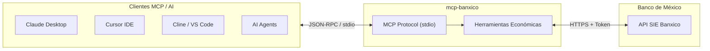

# 🇲🇽 mcp-banxico

<!-- mcp-name: io.github.nanisadw3/banxico -->

[](https://pypi.org/project/mcp-banxico/)
[](https://www.python.org/)
[](https://opensource.org/licenses/MIT)
[](https://modelcontextprotocol.io/)
[]()

Servidor comunitario de **Model Context Protocol (MCP)** para conectar asistentes de Inteligencia Artificial (**Claude Desktop**, **Cursor**, **Cline**, **Gemini CLI**) con el **Sistema de Información Económica (SIE) del Banco de México (Banxico)**.

Permite a tus modelos y agentes de IA consultar en tiempo real el tipo de cambio oficial (USD/MXN), inflación (INPC), valor de las UDIS, tasas de interés interbancarias (TIIE) y cualquier serie económica oficial de México.

> **Proyecto independiente.** No está afiliado ni respaldado por el Banco de México. Consume la API pública del SIE. Si lo instalas en local necesitas tu propio token gratuito; el endpoint remoto de más abajo no lo requiere.

## ▶️ Demo en video

[](https://www.youtube.com/watch?v=saaD665cn9g)

Diez minutos sin cortes: un modelo local (Qwen 2.5 en Ollama) y Claude Desktop pasan de *"no tengo acceso en tiempo real"* a responder con el tipo de cambio oficial. El momento clave está en el [minuto 2:52](https://www.youtube.com/watch?v=saaD665cn9g&t=172s).

## 📈 Datos en vivo

**[banxico-mcp.duckdns.org](https://banxico-mcp.duckdns.org/)**: tipo de cambio (dólar, euro, libra, dólar canadiense y yen), tasas de interés, curva de CETES, inflación, UDIS y reservas internacionales, 22 indicadores oficiales que se actualizan cada día hábil. Cada uno se puede descargar en CSV. Vive en el mismo dominio que el endpoint remoto de este servidor.

---

## 🏗️ Arquitectura


```mermaid
flowchart LR
    subgraph Clientes["Clientes MCP / AI"]
        Claude["Claude Desktop"]
        Cursor["Cursor IDE"]
        Cline["Cline / VS Code"]
        Agents["AI Agents"]
    end

    subgraph Server["mcp-banxico"]
        MCP["MCP Protocol (stdio)"]
        Tools["Herramientas Económicas"]
    end

    subgraph Banxico["Banco de México"]
        SIE["API SIE Banxico"]
    end

    Clientes <-->|JSON-RPC / stdio| MCP
    MCP --> Tools
    Tools <-->|HTTPS + Token| SIE
```

---

## ⚡ Instalación y Uso Rápido

### Opción 0: Endpoint remoto (sin instalar nada, sin token)

Hay una instancia pública hospedada. No requiere instalación ni que saques tu
propio token de Banxico:

```
https://banxico-mcp.duckdns.org/mcp
```

Transporte `streamable-http`. En Claude Desktop:

```json
{
  "mcpServers": {
    "banxico": {
      "type": "streamable-http",
      "url": "https://banxico-mcp.duckdns.org/mcp"
    }
  }
}
```

> Es un servicio comunitario en infraestructura propia, con límite de peticiones
> por IP. Para uso intensivo o en producción, instálalo localmente con tu token:
> así no dependes de que esta instancia esté disponible.

#### Probarlo a mano (curl o Postman)

El endpoint habla JSON-RPC 2.0 sobre HTTP POST. Son dos peticiones: una para
abrir sesión y otra para llamar la herramienta.

**1. Abrir sesión.** La respuesta trae el header `mcp-session-id`:

```bash
curl -i -X POST https://banxico-mcp.duckdns.org/mcp \
  -H 'Content-Type: application/json' \
  -H 'Accept: application/json, text/event-stream' \
  -d '{
    "jsonrpc": "2.0",
    "id": 1,
    "method": "initialize",
    "params": {
      "protocolVersion": "2025-06-18",
      "capabilities": {},
      "clientInfo": { "name": "curl", "version": "1" }
    }
  }'
```

**2. Llamar una herramienta**, pasando ese id en el header:

```bash
curl -X POST https://banxico-mcp.duckdns.org/mcp \
  -H 'Content-Type: application/json' \
  -H 'Accept: application/json, text/event-stream' \
  -H 'mcp-session-id: EL_ID_DEL_PASO_1' \
  -d '{
    "jsonrpc": "2.0",
    "id": 2,
    "method": "tools/call",
    "params": { "name": "tipo_cambio_usd", "arguments": {} }
  }'
```

Respuesta (el contenido viaja como evento SSE, en la línea `data:`):

```json
{
  "serie": "TIPO_CAMBIO_FIX",
  "id_serie": "SF43718",
  "nombre": "Tipo de cambio FIX (Pesos por Dólar)",
  "unidad": "Pesos por dólar",
  "fecha": "28/09/2026",
  "valor": "17.8413"
}
```

Otros ejemplos de `params`:

```json
{ "name": "inflacion_mexico",         "arguments": { "tipo": "anual" } }
{ "name": "valor_udis",               "arguments": {} }
{ "name": "tasa_interes_banxico",     "arguments": { "tipo": "objetivo" } }
{ "name": "reservas_internacionales", "arguments": {} }
{ "name": "consultar_serie_sie",      "arguments": { "id_serie": "SF43718",
                                                     "fecha_inicio": "2026-09-01",
                                                     "fecha_fin": "2026-09-28" } }
```

> **Dos cosas que confunden al probar desde Postman.**
> El header `mcp-session-id` es obligatorio a partir de la segunda petición:
> sin él la respuesta es `400`. Y si mandas `Accept: application/json` a secas
> obtienes `406` — el servidor exige aceptar **ambos** tipos, o puedes omitir
> el header por completo.

### Opción 1: Con `uvx` (Recomendado para Claude Desktop y Cursor)

```bash
uvx mcp-banxico
```

### Opción 2: Con `pip`

```bash
pip install mcp-banxico
mcp-banxico
```

---

## 🛠️ Configuración en Clientes de IA

### 1. Claude Desktop
Agrega la siguiente configuración a tu archivo `claude_desktop_config.json`:

* **macOS:** `~/Library/Application Support/Claude/claude_desktop_config.json`
* **Windows:** `%APPDATA%\Claude\claude_desktop_config.json`

```json
{
  "mcpServers": {
    "banxico": {
      "command": "uvx",
      "args": ["mcp-banxico"],
      "env": {
        "BANXICO_TOKEN": "TU_TOKEN_DE_BANXICO_AQUI"
      }
    }
  }
}
```

### 2. Cursor IDE
En `Settings` -> `Features` -> `MCP Servers` -> `Add new MCP server`:
* **Name:** `banxico`
* **Type:** `command`
* **Command:** `uvx mcp-banxico`

---

## 📊 Herramientas Disponibles para la IA

| Herramienta | Serie Banxico | Descripción |
| :--- | :--- | :--- |
| `tipo_cambio_usd` | `SF43718` / `SF60653` | Consulta el tipo de cambio oficial peso/dólar (FIX o liquidación), hoy o en un rango de fechas. |
| `inflacion_mexico` | `SP74625` / `SP68257` | Consulta la inflación general anual o mensual de México basada en el INPC. |
| `valor_udis` | `SP68254` | Consulta el valor oficial de las Unidades de Inversión (UDIS) en pesos mexicanos. |
| `tasa_interes_banxico` | `SF61745` / `SF43783` | Consulta la TIIE a 28 días o la Tasa Objetivo de fondeo interbancario. |
| `reservas_internacionales`| `SF46410` | Saldo actual de reservas internacionales netas en millones de USD. |
| `consultar_serie_sie` | *Cualquiera* | Consulta avanzada para cualquier ID de serie del catálogo general de Banxico. |

---

## 🌐 Hospedar tu propia instancia remota

```bash
mcp-banxico --transport streamable-http \
            --host 127.0.0.1 --port 8005 \
            --allowed-host tu-dominio.example
```

`--allowed-host` es obligatorio detrás de un proxy inverso: el transporte HTTP
valida el header `Host` contra ataques de DNS rebinding y, sin declarar el
nombre público, responde `421` a todas las peticiones.

La caché en memoria (1 h por defecto, `BANXICO_CACHE_TTL` para ajustarla)
evita que el token compartido agote su límite en el SIE.

---

## 🔑 Cómo obtener tu Token de Banxico

Banxico proporciona acceso público y gratuito a su API:
1. Ingresa a: **[Portal de Tokens de Banxico SIE](https://www.banxico.org.mx/SieAPIRest/service/v1/token)**
2. Ingresa tu correo y solicita tu token. Te llegará inmediatamente.
3. Configúralo en tu entorno:
   ```bash
   export BANXICO_TOKEN="tu_token_aqui"
   ```

---

## 🧪 Verificación Local

Puedes probar que tu token y la conexión funcionen correctamente ejecutando:

```bash
mcp-banxico --test
```

Salida esperada:
```text
============================================================
mcp-banxico v0.1.0 - Verificación de Conexión a Banxico SIE
============================================================
Consultando tipo de cambio FIX (serie SF43718)...
-> Éxito: Fecha 18/09/2026, Valor: $19.92 MXN por USD
```

---

## 💻 Desarrollo y Pruebas

Para contribuir localmente:

```bash
git clone https://github.com/nanisadw3/mcp-banxico.git
cd mcp-banxico
python -m venv .venv
source .venv/bin/activate
pip install -e ".[dev]"
pytest --cov=mcp_banxico
```

---

## 📄 Licencia

Distribuido bajo la Licencia **MIT**. Consulta el archivo [LICENSE](LICENSE) para más detalles.

Desarrollado con ❤️ en México por **[Inaki Sobera (nanisadw3)](https://github.com/nanisadw3)**.
